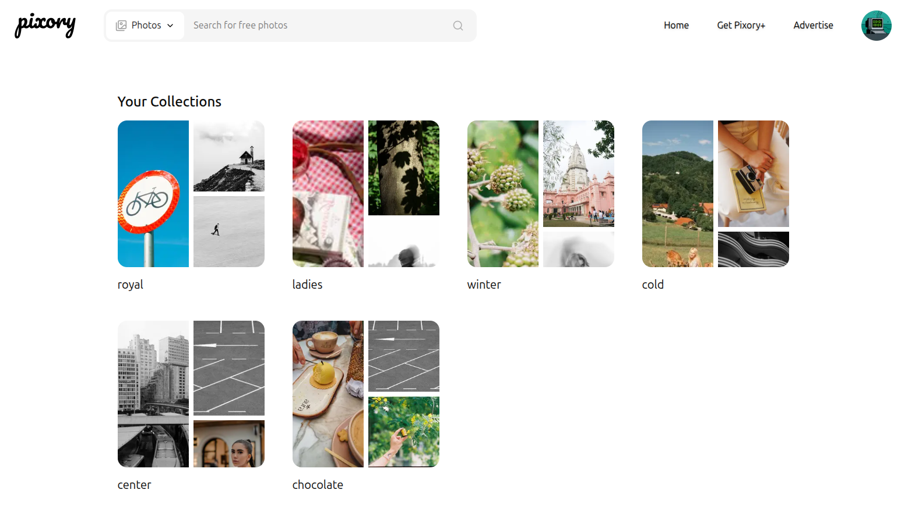
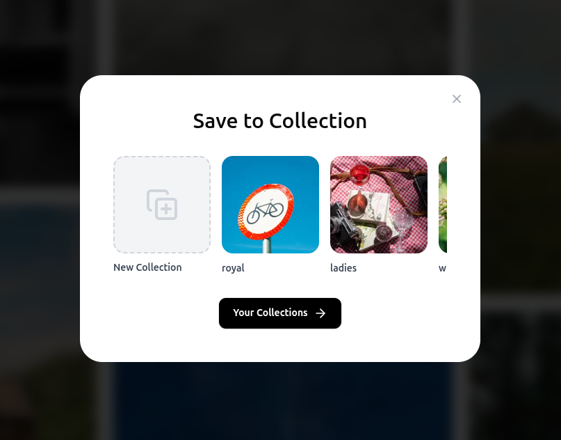

# 📸 Pixory

Pixory is a visually rich web application inspired by Pexels. It allows users to explore, search, collect, bookmark, and download high-quality photos and videos using the [Pexels API](https://www.pexels.com/api/). It offers a sleek UI and several user-friendly features like recent searches, collections, and multi-size download options.

---

## 🌟 Features

- 🔍 **Search Photos & Videos**  
  Users can search for either photos or videos using a dropdown filter.
  

- 🖼️ **Pagination**  
  Results are paginated for better performance and navigation.
  

- 💾 **Download in Multiple Sizes**  
  Download media in portrait, landscape, or original resolutions.
  

- 📂 **Create & Manage Collections**  
  Organize photos and videos into custom collections.
  

- 🔖 **Bookmark**  
  Easily bookmark favorite items to save in collections.
  

- 🕵️‍♂️ **Recent Searches**  
  View recent searches directly in the search bar menu.
  

- 📤 **Share Searches**  
  Share the URL of a specific search result with others.
  

- 🔐 **Authentication**  
  Login/Logout functionality to save user preferences and collections.
  

---

## 🌟 Project Structure

pixory/              
├── app/                  
├── components/           
├── hooks/                
├── lib/                 
├── prisma/              
├── public/              
├── screenshots/         
├── .env.local            
├── .gitignore            
├── .prettierrc.json     
├── eslint.config.mjs    
├── global.d.ts           
├── middleware.ts        
├── next-env.d.ts         
├── next.config.ts       
├── package.json          
├── package-lock.json     
├── postcss.config.mjs    
├── README.md             
└── tsconfig.json         

